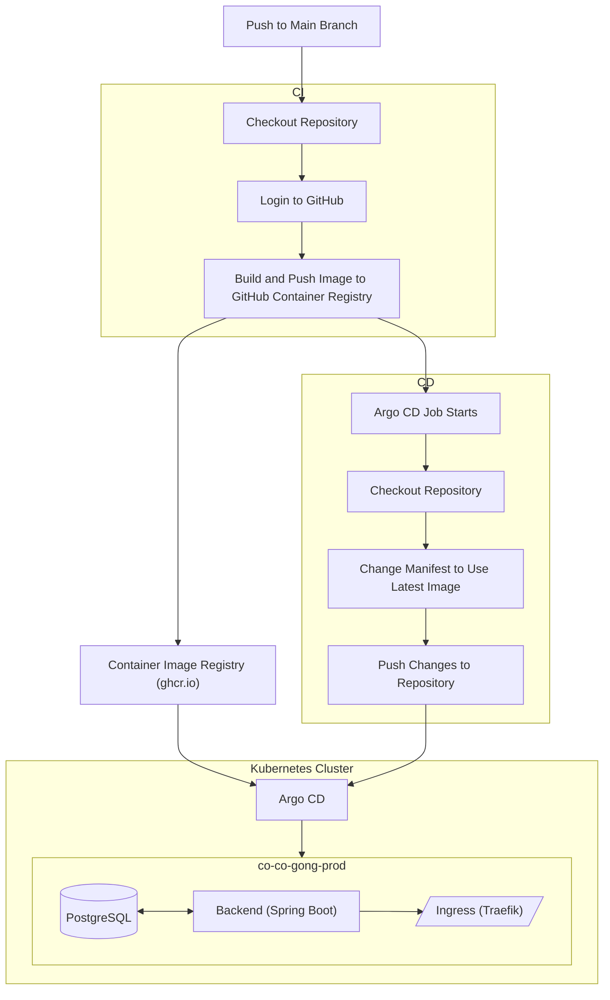
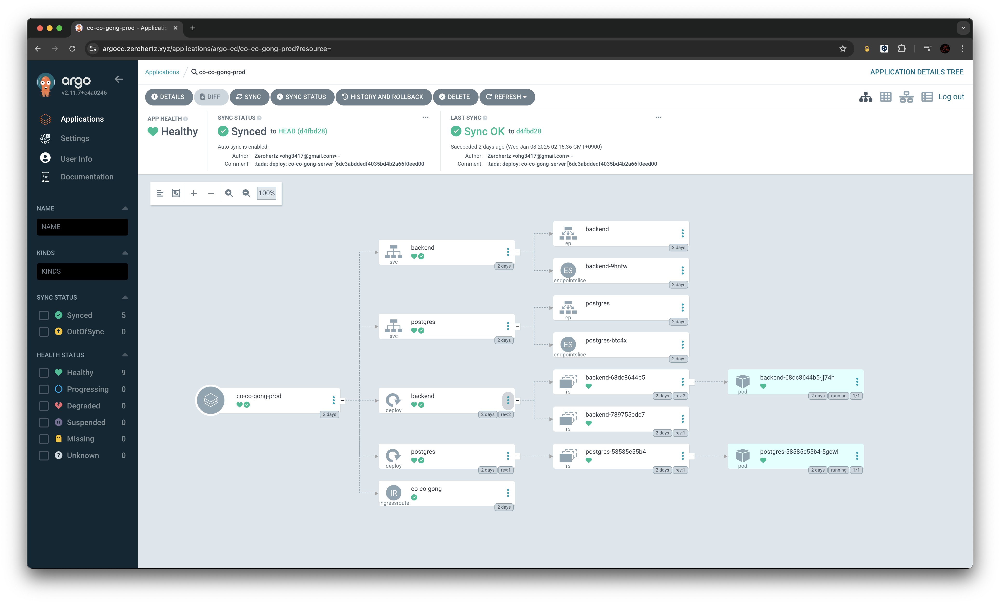

## CI/CD

1. [Branch 규약](./branch.md)에 맞춰 branch 생성하여 개발
2. PR 생성 시 [Spring test](./test.md) 실행
3. Codecov를 통한 coverage 검사 후 만족 시 `main` branch로 merge
4. [Dockerfile](../Dockerfile)에 따라 GitHub Actions를 통한 container image build 후 ghcr.io에 배포 (`ghcr.io/co-co-gong/co-co-gong-server:latest`)
5. GitHub SHA를 [k8s manifest](../k8s/deploy/backend.yaml)에 변경 (container image tag)하여 Argo CD에서 자동 배포 수행

