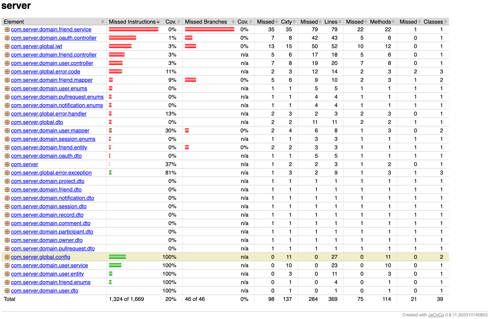
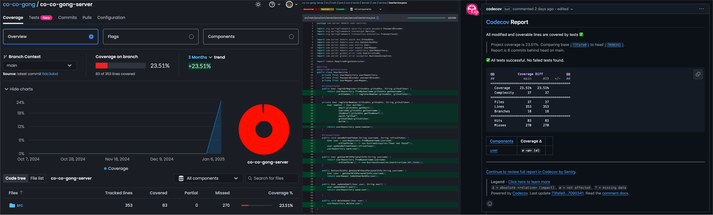

## Spring test 규약

- `JUnit`: Java 단위 test framework
  - 목적: Code 검증
  - 사용법: `@Test`, `@BeforeEach` 등 annotation으로 test 구성
- `Mockito`: Mocking library
  - 목적: 의존성 격리
  - 사용법: 가짜 객체 생성으로 독립적 test 수행
- `JaCoCo`: Code coverage 측정 도구
  - 목적: Test coverage 분석
  - 사용법: Test 후 coverage report 제공

## Spring test 시 debugging

1. `@Slf4j` annotation을 추가한다.

```java
@Slf4j
class UserServiceTest {
```

2. 아래와 같이 `--info`를 통해 logger 수준을 설정한다.

```shell
$ ./gradlew clean test --info | grep ERROR
    2025-01-07T21:21:19.197+09:00 ERROR 13537 --- [co-co-gong-server] [    Test worker] c.s.domain.user.service.UserServiceTest  : -----------------
```

## JaCoCo

```shell
$ cd ./build/jacocoHtml && python -m http.server 8000
Serving HTTP on 0.0.0.0 port 8000 (http://0.0.0.0:8000/) ...
{IP}.{IP}.{IP}.{IP} - - [07/Jan/2025 21:44:45] "GET / HTTP/1.1" 200 -
{IP}.{IP}.{IP}.{IP} - - [07/Jan/2025 21:44:45] "GET /jacoco-resources/report.css HTTP/1.1" 200 -
{IP}.{IP}.{IP}.{IP} - - [07/Jan/2025 21:44:45] "GET /jacoco-resources/sort.js HTTP/1.1" 200 -
{IP}.{IP}.{IP}.{IP} - - [07/Jan/2025 21:44:45] "GET /jacoco-resources/redbar.gif HTTP/1.1" 200 -
{IP}.{IP}.{IP}.{IP} - - [07/Jan/2025 21:44:45] "GET /jacoco-resources/greenbar.gif HTTP/1.1" 200 -
{IP}.{IP}.{IP}.{IP} - - [07/Jan/2025 21:44:45] "GET /jacoco-resources/session.gif HTTP/1.1" 200 -
{IP}.{IP}.{IP}.{IP} - - [07/Jan/2025 21:44:45] "GET /jacoco-resources/report.gif HTTP/1.1" 200 -
{IP}.{IP}.{IP}.{IP} - - [07/Jan/2025 21:44:45] "GET /jacoco-resources/sort.gif HTTP/1.1" 200 -
{IP}.{IP}.{IP}.{IP} - - [07/Jan/2025 21:44:45] "GET /jacoco-resources/down.gif HTTP/1.1" 200 -
{IP}.{IP}.{IP}.{IP} - - [07/Jan/2025 21:44:45] "GET /jacoco-resources/package.gif HTTP/1.1" 200 -
```



## [Codecov](https://app.codecov.io/gh/co-co-gong/co-co-gong-server)


